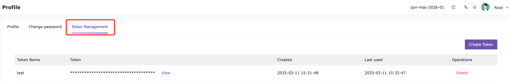

# Nightingale MCP Server

English | [中文](README_zh.md)

[](https://go.dev/)
[](LICENSE)
[](https://modelcontextprotocol.io/)

An MCP (Model Context Protocol) server for [Nightingale](https://github.com/ccfos/nightingale) monitoring system. This server enables AI assistants to interact with Nightingale APIs for alert management, monitoring, and observability tasks through natural language.

## Key Use Cases

- **Alert Management**: Query active and historical alerts, view alert rules and subscriptions
- **Target Monitoring**: Browse and search monitored hosts/targets, analyze target status
- **Incident Response**: Create and manage alert mutes/silences, notification rules, and event pipelines
- **Team Collaboration**: Query users, teams, and business groups

## Getting Started

### Getting an API Token

1. Log in to your Nightingale web interface
2. Navigate to **Personal Settings** > **Profile** > **Token Management**
3. Create a new token with appropriate permissions



> **Security Note**: Store your API token securely. Never commit tokens to version control. Use environment variables or secure secret management.

## Usage with MCP Clients

### OpenCode

Add to your `~/.opencode/mcp.json`:

```json
{
  "mcpServers": {
    "nightingale": {
      "command": "npx",
      "args": ["-y", "@n9e/n9e-mcp-server", "stdio"],
      "env": {
        "N9E_TOKEN": "your-api-token",
        "N9E_BASE_URL": "http://your-n9e-server:17000"
      }
    }
  }
}
```

### Cursor

Add to your `~/.cursor/mcp.json`:

```json
{
  "mcpServers": {
    "nightingale": {
      "command": "npx",
      "args": ["-y", "@n9e/n9e-mcp-server", "stdio"],
      "env": {
        "N9E_TOKEN": "your-api-token",
        "N9E_BASE_URL": "http://your-n9e-server:17000"
      }
    }
  }
}
```

## Installation & Configuration

### Install

Use directly with npx (no installation required):

```bash
npx -y @n9e/n9e-mcp-server stdio
```

Or install globally:

```bash
npm install -g @n9e/n9e-mcp-server
```

Alternative: Download pre-built binaries from [Releases](https://github.com/n9e/n9e-mcp-server/releases) or build from source with `make build`.

### Environment Variables

| Variable | Flag | Description | Default |
|----------|------|-------------|---------|
| `N9E_TOKEN` | `--token` | Nightingale API token (required) | - |
| `N9E_BASE_URL` | `--base-url` | Nightingale API base URL | `http://localhost:17000` |
| `N9E_READ_ONLY` | `--read-only` | Disable write operations | `false` |
| `N9E_TOOLSETS` | `--toolsets` | Enabled toolsets (comma-separated) | `all` |
| `N9E_MCP_LOG_LEVEL` | - | Log level: `debug`, `info`, `warn`, `error` | `info` |


## Available Tools

| Toolset | Tool | Description |
|---------|------|-------------|
| alerts | `list_active_alerts` | List currently firing alerts with optional filters |
| alerts | `get_active_alert` | Get details of a specific active alert by event ID |
| alerts | `list_history_alerts` | List historical alerts with optional filters |
| alerts | `get_history_alert` | Get details of a specific historical alert |
| alerts | `list_alert_rules` | List alert rules for a business group |
| alerts | `get_alert_rule` | Get details of a specific alert rule |
| targets | `list_targets` | List monitored hosts/targets with optional filters |
| datasource | `list_datasources` | List all available datasources |
| mutes | `list_mutes` | List alert mutes/silences for a business group |
| mutes | `get_mute` | Get details of a specific alert mute |
| mutes | `create_mute` | Create a new alert mute/silence rule |
| mutes | `update_mute` | Update an existing alert mute/silence rule |
| notify_rules | `list_notify_rules` | List all notification rules |
| notify_rules | `get_notify_rule` | Get details of a specific notification rule |
| alert_subscribes | `list_alert_subscribes` | List alert subscriptions for a business group |
| alert_subscribes | `list_alert_subscribes_by_gids` | List subscriptions across multiple business groups |
| alert_subscribes | `get_alert_subscribe` | Get details of a specific subscription |
| event_pipelines | `list_event_pipelines` | List all event pipelines/workflows |
| event_pipelines | `get_event_pipeline` | Get details of a specific event pipeline |
| event_pipelines | `list_event_pipeline_executions` | List execution records for a specific pipeline |
| event_pipelines | `list_all_event_pipeline_executions` | List all execution records across all pipelines |
| event_pipelines | `get_event_pipeline_execution` | Get details of a specific execution |
| users | `list_users` | List users with optional filters |
| users | `get_user` | Get details of a specific user |
| users | `list_user_groups` | List user groups/teams |
| users | `get_user_group` | Get details of a user group including members |
| busi_groups | `list_busi_groups` | List business groups accessible to the current user |

## Example Prompts

Once configured, you can interact with Nightingale using natural language:

- "Show me all critical alerts from the last 24 hours"
- "What alerts are currently firing?"
- "List all monitored targets that have been down for more than 5 minutes"
- "What alert rules are configured in business group 1?"
- "Create a mute rule for service=api alerts for the next 2 hours due to maintenance"
- "Show me the event pipeline execution history"
- "Who are the members of the ops team?"

## License

Apache License 2.0

## Related Projects

- [Nightingale](https://github.com/ccfos/nightingale) - The enterprise-level cloud-native monitoring system
- [MCP Go SDK](https://github.com/modelcontextprotocol/go-sdk) - Official MCP SDK for Go
- [MCP Specification](https://modelcontextprotocol.io/) - Model Context Protocol specification
